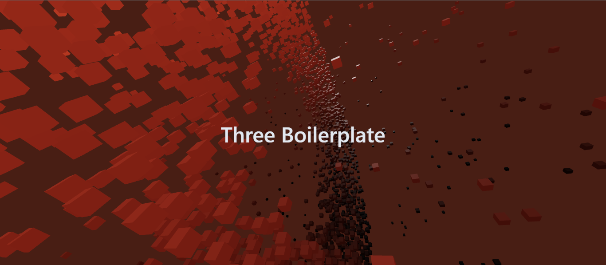

<a href="https://github.com/whosramoss/three-boilerplate">
  
  <h1 align="center">Three Boilerplate</h1>
</a>

<p align="center">
  Three Boilerplate is a quick starter template for React/Typescript projects usint Three.js, designed to build dynamic and engaging web experiences.
</p>

<div align="center">
  
  
  
  
</div>
<br/>
<a href="./three-boilerplate-thumbnail.gif">
  <p align="center">Check the preview</p>
</a>
<br/>

## How to install

```bash
  # Clone the project
  git clone https://github.com/whosramoss/three-boilerplate/

  # Go to the project directory
  cd three-boilerplate

  # Install dependencies
  npm install

  # Start the server 
  npm run dev
```
